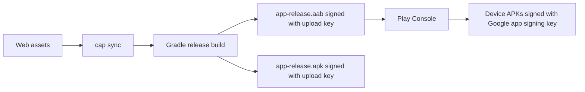

# Plan: Build and sign Mathtizzy for Play (and a local APK)

This is the release plan for `com.petraguardsoftware.mathtizzy`. Follow it in order. Do not start from the debug APK Android Studio already produced — Play will reject a debug-signed build.

## What “certs from Google” actually are

Play Console lets you **download certificates** (`.pem` / `.der`) from:

**Test and release → App integrity → App signing**  
(or **Protected with Play → Play app signing**)

Those files are **public certificates only**. They contain fingerprints (SHA-1 / SHA-256) so APIs can recognize the app. **They do not contain a private key, so you cannot sign an APK or AAB with them.**

Signing always needs a **keystore** (`.jks` / `.keystore`) that holds the **private key**. Google never gives you the private app-signing key when Play App Signing is on (the default for new apps).

Two keys are in play:

| Key | Who holds the private key | What it is for |
| --- | --- | --- |
| **Upload key** | You, in a `.jks` file on disk | Sign the `.aab` / `.apk` you build locally before upload |
| **App signing key** | Google | Sign the APKs Play installs on devices |

Local Gradle / Android Studio signs with the **upload key**. Google re-signs the store APKs with the **app signing key**.

If you need an APK that is **actually signed by Google** (same signature Play ships to users), build and upload an AAB, then download the signed APK from Play — do not try to apply the downloaded `.pem` / `.der` yourself.



---

## Current repo state (what is missing)

Already in place:

- Capacitor 8 Android project at `android/`, module `:app`
- App id `com.petraguardsoftware.mathtizzy`
- `versionCode 2` / `versionName "1.0.1"` in `android/app/build.gradle`
- Web copy + sync: `npm run cap:sync` (copies into `www/`, then into the native project)
- Play listing copy and graphics in `playStoreAssets/`

Not in place yet:

- No `signingConfigs` in `android/app/build.gradle` (release currently uses the debug keystore)
- No `key.properties` / `.jks` in the repo (correct — those must stay off git)
- `android/.gitignore` still has `*.jks` / `*.keystore` **commented out**; uncomment those before the first keystore exists

---

## Choose the artifact

| Goal | Artifact | Signer |
| --- | --- | --- |
| Upload to Play (required for new apps) | **Android App Bundle** `.aab` | Your **upload** keystore |
| Sideload / email a build that is **not** the Play signature | Release `.apk` | Your **upload** keystore |
| Sideload a build that **matches** Play (updates over a Play install) | APK downloaded from Play after you upload the AAB | Google **app signing** key |

Play Console does not accept a new-app APK as the store package. Build an **AAB** for the store. Build an APK only for local testing, or download Google-signed APKs from the bundle explorer after upload.

---

## Step 1 — Create or locate the upload keystore

If Play Console already shows an **upload key certificate**, you must sign with the **same** keystore that produced it. A new keystore will be rejected until you request an upload-key reset.

If you do **not** have a keystore yet (first release):

In PowerShell, with JDK 21 on `PATH` (Android Studio’s JBR is fine):

```powershell
keytool -genkeypair -v `
  -keystore "$env:USERPROFILE\keystores\mathtizzy-upload.jks" `
  -alias upload `
  -keyalg RSA -keysize 2048 -validity 9125 `
  -storetype JKS
```

- Store it **outside** the git repo (for example `%USERPROFILE%\keystores\`).
- Use a strong store password and key password; write them in a password manager, not in chat or git.
- Validity is 25 years (`9125` days). Play requires the cert to remain valid past 22 Oct 2033.
- Alias `upload` is conventional; if you pick another name, use that same alias in `key.properties`.

Export the **public** cert only if Play asks you to register an upload key (or you need a reset):

```powershell
keytool -export -rfc `
  -keystore "$env:USERPROFILE\keystores\mathtizzy-upload.jks" `
  -alias upload `
  -file "$env:USERPROFILE\keystores\mathtizzy-upload-certificate.pem"
```

That `.pem` is safe to upload to Play. Never share the `.jks`.

Optional check that the local cert matches Play’s upload-key SHA-256:

```powershell
keytool -list -v -keystore "$env:USERPROFILE\keystores\mathtizzy-upload.jks" -alias upload
```

Compare the SHA-256 to **Upload key certificate** on the Play app-signing page.

---

## Step 2 — Keep secrets out of git

Before the keystore or passwords exist on disk:

1. In `android/.gitignore`, uncomment:

   ```
   *.jks
   *.keystore
   ```

2. Add:

   ```
   key.properties
   ```

3. Confirm `local.properties` stays ignored (it already is).

Create `android/key.properties` (never commit this file):

```
storeFile=C:\\Users\\<you>\\keystores\\mathtizzy-upload.jks
storePassword=<keystore password>
keyAlias=upload
keyPassword=<key password>
```

Use a real absolute path. Forward slashes also work: `C:/Users/<you>/keystores/mathtizzy-upload.jks`.

---

## Step 3 — Wire Gradle release signing

In `android/app/build.gradle`, load `key.properties` when present and attach it to the `release` build type. Planned shape (Groovy, matching this project):

```gradle
def keystorePropertiesFile = rootProject.file("key.properties")
def keystoreProperties = new Properties()
if (keystorePropertiesFile.exists()) {
    keystoreProperties.load(new FileInputStream(keystorePropertiesFile))
}

android {
    // ... existing namespace / defaultConfig ...

    signingConfigs {
        release {
            if (keystorePropertiesFile.exists()) {
                keyAlias keystoreProperties["keyAlias"]
                keyPassword keystoreProperties["keyPassword"]
                storeFile file(keystoreProperties["storeFile"])
                storePassword keystoreProperties["storePassword"]
            }
        }
    }

    buildTypes {
        release {
            minifyEnabled false
            proguardFiles getDefaultProguardFile("proguard-android.txt"), "proguard-rules.pro"
            signingConfig signingConfigs.release
        }
    }
}
```

`storeFile` is already an absolute path, so `file(...)` is enough. Do not put passwords in `build.gradle`.

Bump `versionCode` / `versionName` in the same file for every Play upload. Play rejects a `versionCode` that was already used. Current values: `2` / `"1.0.1"`.

---

## Step 4 — Sync web assets, then build

From the repo root (Node 22+, JDK 21, Android SDK 36 as in the README):

```powershell
npm install
npm run cap:sync
cd android
.\gradlew.bat bundleRelease
.\gradlew.bat assembleRelease
```

Or in Android Studio: **Build → Generate Signed Bundle / APK**, choose **Android App Bundle**. Pick the same `.jks` / alias / passwords.

`cap:sync` runs `scripts/copy-www.mjs` then `npx cap sync`. Skip that and you will ship stale `index.html` / `app.js`.

Outputs:

| File | Path |
| --- | --- |
| Store upload | `android/app/build/outputs/bundle/release/app-release.aab` |
| Local APK (upload-key signed) | `android/app/build/outputs/apk/release/app-release.apk` |

If `bundleRelease` says the release config is unsigned, `key.properties` is missing, the path is wrong, or `signingConfig signingConfigs.release` was not applied.

---

## Step 5 — Upload the AAB (Google signs the real APKs)

1. Play Console → Mathtizzy → **Test and release** → internal / closed / production.
2. Create a release and upload `app-release.aab`.
3. First upload enrolls Play App Signing (Google-generated app signing key unless you already changed it).
4. Play verifies the AAB against the **upload** certificate, then generates device APKs signed with the **app signing** key.

That is the step where “certs from Google” get used — by Google, on their builders, not by Gradle on this machine.

---

## Step 6 — If you need a Google-signed APK

After the AAB is processed:

1. **Test and release → App bundle explorer** (or **Latest releases and bundles**).
2. Select this version.
3. **Downloads**: universal APK and/or device-specific APKs. Those are signed with the **app signing** key.

Use that APK when you want sideload installs to match Play (so a later Play update can install over it).

The APK from `assembleRelease` will **not** update over a Play install (and vice versa), because the upload key ≠ the app signing key.

Install a local upload-key APK:

```powershell
adb install -r android\app\build\outputs\apk\release\app-release.apk
```

Install a Play-signed split set from the bundle explorer with `adb install-multiple` if Play gives several APKs instead of one universal APK.

---

## Step 7 — Verify before you ship

Confirm the local AAB/APK is signed with the upload key, not debug:

```powershell
# APK
apksigner verify --print-certs android\app\build\outputs\apk\release\app-release.apk
```

`apksigner` ships with the Android SDK build-tools. SHA-256 must match Play’s **upload** certificate, not the debug cert (`CN=Android Debug`).

In Play Console, the release should show:

- Package: `com.petraguardsoftware.mathtizzy`
- Version code / name matching `build.gradle`
- App signing: **Protected by Play App Signing**

---

## Fingerprints vs signing (do not mix these up)

Download Google’s `.pem` / `.der` files when a **service** asks for SHA-1 / SHA-256 (Maps, OAuth, App Links, etc.). Register the **app signing** fingerprints for anything that sees the Play-installed app. The upload-key fingerprint is only for the file you upload.

This app does not currently call Google APIs that need those fingerprints. Skip this until something asks.

---

## Out of scope for the first signed build (unless blocked)

- Enabling R8 / minify (`minifyEnabled` is already `false`)
- Play App Signing key upgrade / quantum-ready extras (Play handles this after upload)
- CI secrets (fine later; first release can be a local `key.properties` + `gradlew`)
- iOS

---

## Done when

- [ ] Upload `.jks` exists off-repo; SHA-256 matches Play’s upload certificate (or Play has no upload cert yet and this is the first one)
- [ ] `android/key.properties` exists locally and is gitignored
- [ ] `android/.gitignore` ignores `*.jks`, `*.keystore`, and `key.properties`
- [ ] `android/app/build.gradle` signs `release` from `key.properties`
- [ ] `npm run cap:sync` then `.\gradlew.bat bundleRelease` produces `app-release.aab`
- [ ] AAB uploaded to a Play track; Play shows it as signed / processed
- [ ] Optional: Google-signed APK downloaded from app bundle explorer if you need a Play-matching sideload build
